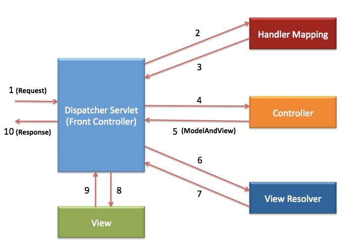

# Spring MVC and Integration tests with WebMVC 

This project demonstrates how Spring MVC can serve web content and how the integration tests are implemented with WebMVC

High level diagram:

Note: [Download](./assets/presentation/serving-web-content.pptx) Web Content With Spring MVC Presentation.

## 1. Requirements

- Unix/Linux OS
- Java 8+

## 2. Installation

- `make build` - for building the jar
